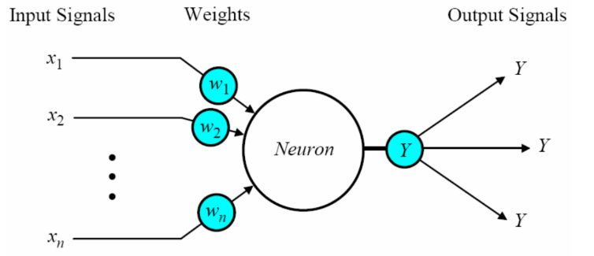
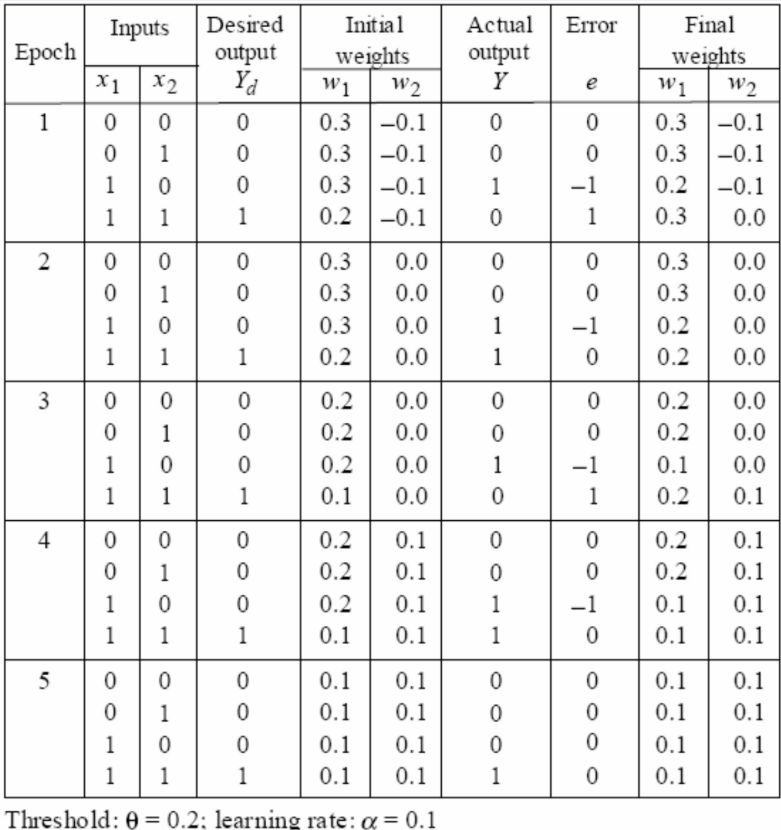

## Neural Networks
### Origin (Inspiration)
We based the idea of neural networks on the way we understand the workings of a human brain with billions of neurons and even more connections. While not at the same scale, neural networks attempt to mimic just that. 

This army of neurons helps the brain reason and perform operations faster than anything man has been able to recreate, so it was a good idea to inspire a model off of this. 

The neurons in the neural network work similarly by creating simple neurons that on their own do at max some vector multiplications and addition. But, on scale this huge cluster of neurons and connections working together creates some very impressive reasoning and learning models.

We connect these nodes with weighted links passing signals from one neuron to another. 

### Learning
We start with random weights and biases = 0 usually with neural networks and through getting results with a forward pass and tuning the weights and biases with back propagation, we converge to optimal values for W and b which give the best results. Its unsupervised, so these values are calculated by a learning set where we compare output with actual answer through which the model improves. All of this will be expanded on later, but here's a small intro to how it works simply.

### Actual ML Model
A neural network is divided into branches for clearer parallel work. We divide these up in 3 main layers—Input layer (start) , Hidden layers (middle) and Output Layer (end). These layers on parallel add weights and biases to the input to give out an output.

Let's look at a single neuron to understand how it works on the smallest level:

These notes are on the earlier version of the neurons i.e. perceptron which is very similar to a neuron, however we have advanced and optimized how we calculate stuff like activation, error, updates, etc.

#### Forward Pass
At an individual level the neuron receives results from the previous layer, applies weights it has learned overtime are best for the desired output (matrix multiplication—multiply the vector we got with the weight) and add biases, but that is for later (not shown in the figure). After this the resultant vector created is sent to the neurons of next layer (whichever ones it is connected with)

##### Activation Function
The activation function as the name suggests activates certain neurons in the neural network based on the input to create non linearity (instead of all of the neurons constantly calculating in linear all of the weights and biases that aren't even going to contribute to the output, we pick the ones that do). Similar to how a brain when smelling something will fire a different part of its brain and seeing something will trigger a different part. For example in ReLU we say that any result less than 0 should just be considered 0 i.e. not be taken further for calculation as it pretty much doesn't affect the output. The activation function indirectly decides how much each weight gets updated — since it shapes the gradient during backpropagation based on whether a neuron fired and by how much.

Similar to how if you're in a crowded place you won't raise your voice to speak to someone gradually until they can hear you, your brain non linearly raises it based on what it has learned in the past to get to around the right volume.

###### Types of Activation Functions
**Sigmoid Function:** output is 1/(1+e^-(input)). Basically it normalizes values to be between -1 and 1 so as values get more and more negative they get closer and closer to -1 and vice versa for positive values.
**Step Function:** If input greater than or equal to 0, output is 1, else 0.
**Sign Function:** If input greater than or equal to 0, output is 1, else -1.
**Linear Function (how is this even a function):** output is input lol.

**reLU:** if input is less than or equal to 0 output is 0 else output is input. ( I don't see it in slides but its the modern default one to use.)

During back propagation we calculate gradients that are used to determine how weights will update and by how much through a chain rule. This is done by calculating a bunch of derivatives. 

For step and sign functions, that are very binary in their approach (e.g. answer is either 0 or 1), the gradient is very rough and makes the calculation through gradients very inefficient. Its like trying to draw a circle using straight lines. Perceptrons used step function as their weight update was very simple as you'll see in back prop.

For sigmoid an issue arises when these derivatives usually come out to be very small and when in chain rule we multiple all these small values together they approach zero. This problem is known as the vanishing gradient problem where we will practically get no weight updates for early layers of the NN. 

ReLU creates a strong gradients at values greater than 0 and flat lines at 0 and handles vanishing gradient problem by not limiting the output to a range where the original value stays unless it practically has no relevance to the output anyways.

#### Backward Propogation
##### Errors and Updates
In a perceptron error and update calculations were very simple since we didn't base it off a gradient.

###### Error

$$
error = actual - output
$$
This means we will get a negative answer if the output exceeds the actual answer and positive if it is smaller.

###### Weight Update

$$
	w_{i+1} = w_i + \alpha \cdot x_i \cdot e 
$$
here i is the training iteration (epoch), alpha is the learning rate, x is the input, and e is the error.

So, we add a positive or negative number to the weight (depending upon the error) with applied learning rate. We use the input it was given to not update all weights equally but based on what input they got and how much they affect the output i.e. if a neuron had an input of 0 changing its weight wouldn't be needed

###### Learning rate
We multiply by a learning rate (e.g., 0.01) to control how big each update to the weights is. This helps prevent the model from overshooting the minimum of the loss function — which could happen if the steps are too large. By using smaller steps, we move more gradually and carefully toward the optimal weights.

Final Formulas for Perceptron:

Initialize with random values for weights and threshold between [-0.5,0.5].

We use step function for activation. So, weight is calculated as:

$$
Y(p) = \text{step} \left[ \sum_{i=1}^{n} x_i(p) \cdot w_i(p) - \theta \right]
$$

Perceptrons can learn AND and OR operations. Not XOR though :(

#### Back propogation formula for multilayer network

##### Output layer: 

$$
\delta_k(p) = y_k(p) \cdot \left(1 - y_k(p)\right) \cdot e_k(p)
$$

$$
e_k(p) = d_k(p) - y_k(p)
$$
where error gradient is output value * (1- output value), this is the sigmoid derivative multiplied by the error calculated by subtracting actual value from output value.

##### Hidden Layers

$$
\delta_j(p) = y_j(p) \cdot \left(1 - y_j(p) \right) \cdot \sum_{k=1}^{l} \delta_k(p) \cdot w_{jk}(p)
$$
here derivative of sigmoid multiplied with already calculated error gradients of next layer multiplied by the weights to those neurons summed up.

Finally for all layers we calculate adjusted weight by:

$$
w_{jk}(p + 1) = w_{jk}(p) + \Delta w_{jk}(p)
$$
where

$$
\Delta w_{jk}(p) = \alpha \cdot \delta_k(p) \cdot y_j(p)
$$

### Accelerating Multilayer Networks

#### Tanh
Through mathematical analysis we have found that using a hyperbolic tan activation function is better than sigmoid:

Formula:

$$
y = \frac{2a}{1 + e^{-bx}} - a
$$

From further analysis the most efficient values for a and b are 1.716 and 0.667 respectively.

a assures that the value of the derivative at origin (0) is approximately 1. This avoids the vanishing gradient problem. We get faster convergence, smoother gradient flow, etc.

#### Momentum term
In the delta rule mentioned above:

$$
\Delta w_{jk}(p) = \alpha \cdot \delta_k(p) \cdot y_j(p)
$$
we can add a momentum term to accelerate it. We multiply this term with the final weight of the previous epoch. This number spans anywhere between 0 and 1, usually 0.95.

this becomes:

$$
\Delta w_{jk}(p) = \beta \cdot w_{jk}(p-1) + \alpha \cdot \delta_k(p) \cdot y_j(p)
$$

where beta is the momentum term.

#### Heuristics
To speed up convergence while avoiding instability or overshooting, we can apply two heuristics:
1. If the error keeps decreasing steadily for several epochs, increase learning rate slightly
2. If the error goes up and down a lot (i.e., keeps changing sign), reduce learning rate to stabilize learning.

